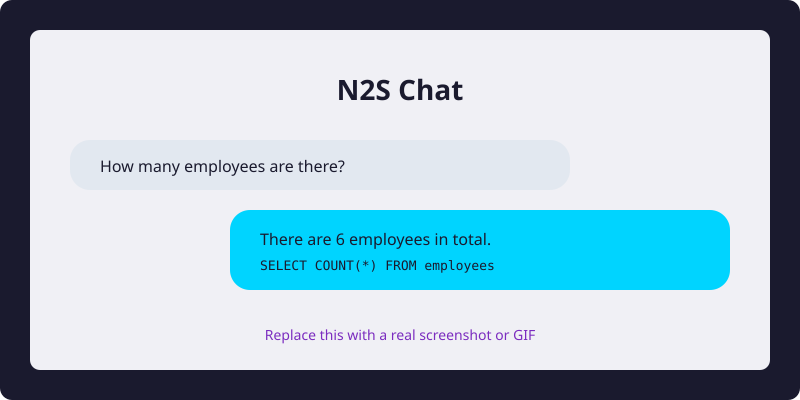

# N2S — Natural-to-SQL Agent

[](https://python.org)
[](LICENSE)
[](docker-compose.yml)

N2S is an open-source **Natural Language → SQL → Insights** agent. It is built on top of the excellent [Vanna](https://github.com/vanna-ai/vanna) 2.0 agent framework and extends it with stronger **tool-calling**, **multi-turn reasoning**, and a built-in **Text2SQL benchmark**.

> **Note:** N2S is a derivative project. It retains Vanna's MIT license and all original copyright notices. See [NOTICE](./NOTICE) for attribution.

---

## 🎬 Demo



With N2S you can ask questions in plain English and get back SQL, result tables, and charts:

```text
User: How many employees are in Engineering?
N2S:  There are 3 employees in Engineering.
      SQL: SELECT COUNT(*) FROM employees WHERE department = 'Engineering'
```

Replace `img/demo-placeholder.svg` with a real screenshot or GIF once you run the demo.

---

## ✨ What N2S Adds

- **Agent + Tool Calling** — N2S reasons over schema, generates SQL, executes it, and visualizes results through an explicit tool loop.
- **Self-Correction** — Failed SQL is captured and fed back to the LLM for automatic retry.
- **Schema Tool** — The agent can introspect the database schema before writing queries, reducing hallucination.
- **Built-in Benchmark** — `python -m n2s.eval` runs a reproducible Text2SQL evaluation and compares multiple LLM providers.
- **One-Command Demo** — `python n2s_app.py` starts a FastAPI server with a web chat UI.

---

## 🚀 Quick Start

### 1. Install

```bash
git clone https://github.com/n2s-ai/n2s.git
cd n2s
pip install -e ".[fastapi]"
```

### 2. Run the mock demo (no API key)

```bash
python n2s_app.py
# Open http://localhost:8000
```

### 3. Run with a real LLM

Supported providers: `mock` (default), `agnes`, `openai`, `anthropic`, `ollama`, `mimo`.

#### Agnes (OpenAI-compatible)
```bash
export N2S_LLM_PROVIDER=agnes
export AGNES_API_KEY=your-key-here
export AGNES_BASE_URL=https://your-agnes-endpoint/v1
python -m n2s.demo
```

#### OpenAI
```bash
export N2S_LLM_PROVIDER=openai
export OPENAI_API_KEY=sk-...
python -m n2s.demo
```

#### Anthropic
```bash
export N2S_LLM_PROVIDER=anthropic
export ANTHROPIC_API_KEY=sk-ant-...
python -m n2s.demo
```

#### Ollama（本地）
```bash
export N2S_LLM_PROVIDER=ollama
export OLLAMA_MODEL=llama3.1
python -m n2s.demo
```

#### Mimo（OpenAI 兼容）
```bash
export N2S_LLM_PROVIDER=mimo
export MIMO_API_KEY=tp-...
export MIMO_MODEL=mimo-v2.5-pro
export MIMO_BASE_URL=https://your-mimo-endpoint/v1
python -m n2s.demo
```

### 4. Run with Docker

```bash
docker-compose up --build
# Open http://localhost:8000
```

---

## 🧪 Benchmark

Evaluate N2S on a small Text2SQL dataset:

```bash
python -m n2s.eval \
  --dataset src/n2s/eval/datasets/n2s_sql.yaml \
  --providers mock openai anthropic
```

Example output (with a real LLM):

```text
Provider: openai
============================================================
  [PASS] emp_count: How many employees are in the database? (1234ms)
      [PASS] trajectory: All expected tools called, no unexpected tools
      [PASS] output: All expected content present, no forbidden content
      [PASS] sql_similarity: Generated SQL matches expected SQL after normalization
      [PASS] sql_execution: Result matched expected value '6'
  ...
------------------------------------------------------------
Summary: 4/5 passed, accuracy 0.92
```

The report includes:

- **Trajectory** — did the agent call the expected tools?
- **Output** — does the final answer contain expected keywords?
- **SQL Similarity** — does the generated SQL match the reference?
- **SQL Execution** — does the generated SQL execute and return the expected result?

---

## 🏗️ Architecture

```text
User Question
    │
    ▼
┌─────────────────┐
│   N2S Agent     │  ← Tool loop + self-correction
└─────────────────┘
    │
    ├──▶ ExplainSchemaTool  (schema introspection)
    ├──▶ RunSqlTool         (SQL execution)
    └──▶ VisualizeDataTool  (Plotly charts)
    │
    ▼
SQLite / PostgreSQL / DuckDB / ...
```

N2S reuses Vanna 2.0's `Agent`, `ToolRegistry`, `RunSqlTool`, `EvaluationRunner`, and FastAPI server scaffolding.

---

## 📦 Project Status

N2S is currently at **v0.1.0**. The focus is on:

1. A runnable product demo (Milestone 1)
2. Agent + tool-calling depth (Milestone 2)
3. Reproducible benchmark (Milestone 3)
4. Dockerized deployment + UI rebranding (Milestone 4)

---

## 🙏 Acknowledgements

N2S is built on [Vanna](https://github.com/vanna-ai/vanna) by Vanna.AI and contributors, used under the MIT License.

## 📄 License

[MIT](./LICENSE)
