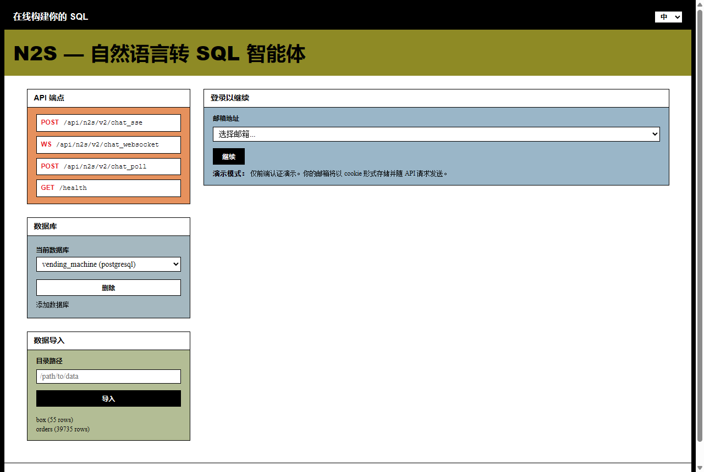
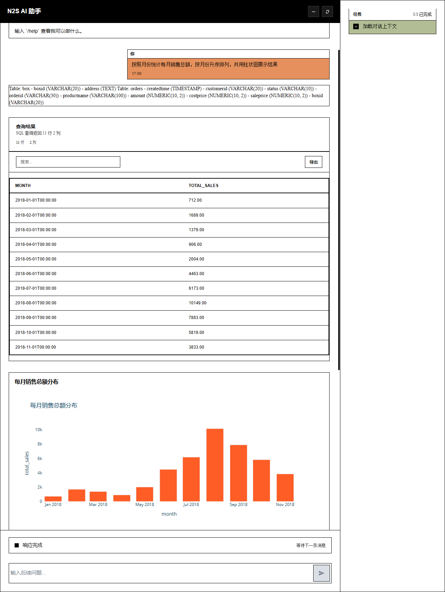

<div align="center">

# N2S — 自然语言转 SQL 智能体

**将自然语言转换为 SQL，执行查询，并可视化结果。**

[](https://python.org)
[](./LICENSE)
[](#常用命令)

[English](README.md) | [中文](README_CN.md)

</div>

N2S 是基于 [Vanna](https://github.com/vanna-ai/vanna) 2.0 构建的自然语言转 SQL 智能体：检查数据库 schema，生成 SQL，执行查询并可视化结果，SQL 失败时自动重试。

> 衍生项目，保留 Vanna 的 MIT 许可证与版权声明，见 [NOTICE](./NOTICE)。

## 功能特性

- **智能体工具循环** — schema 内省 → SQL 生成 → 执行 → 可视化；SQL 失败自动反馈 LLM 重试
- **数据导入管道** — 扫描目录中的 CSV/Excel/JSON/Parquet 文件，自动推断 schema 并导入目标库（LLM 增强 schema 描述，不可用时自动降级）
- **多数据库** — SQLite、PostgreSQL、MySQL、DuckDB、ClickHouse、Oracle、BigQuery、Snowflake、MSSQL、Hive、Presto（SQLAlchemy 统一接入）
- **多 LLM** — OpenAI、Anthropic、Gemini、Ollama 及任意 OpenAI 兼容端点（Agnes、Mimo）；内置 `mock` 无需 API Key
- **内置 Text2SQL 基准测试** — `python -m n2s.eval` 可复现评测、跨提供商对比

## 快速开始

需要 Python 3.9+。Web UI 构建产物已随仓库提交，无需 Node.js。

```bash
git clone https://github.com/wuxiangru915/N2S.git
cd N2S
pip install -e ".[fastapi]"
python n2s_app.py    # 打开 http://localhost:8000
```

默认 `mock` 提供商针对内置 demo 库（`employees`）按预置问题回答。接入真实 LLM：

```bash
export N2S_LLM_PROVIDER=agnes
export AGNES_API_KEY=...
export AGNES_BASE_URL=https://api.deepseek.com/v1   # 任意 OpenAI 兼容端点
export AGNES_MODEL=deepseek-chat
python n2s_app.py
```

其余提供商（`openai`、`anthropic`、`gemini`、`ollama`、`mimo`）的环境变量见 [`.env.example`](.env.example) 与下方表格。

## 架构图

```
                           N2S 架构图
 ┌──────────────────────────────────────────────────────────────────┐
 │                           用户界面                               │
 │                (Web 聊天 / CLI / FastAPI / Flask)                │
 └────────────────────────────┬─────────────────────────────────────┘
                              │
                              ▼
 ┌──────────────────────────────────────────────────────────────────┐
 │                       N2S 智能体核心                             │
 │  ┌──────────┐  ┌───────────────┐  ┌───────────────────────────┐ │
 │  │  Agent   │  │  工具注册表   │  │    工作流处理器            │ │
 │  │  循环    │──│  (工具调用)   │  │ (/help, /status, /mem)   │ │
 │  └────┬─────┘  └───────┬───────┘  └───────────────────────────┘ │
 │       │                │                                         │
 │       │    ┌───────────┼───────────┐                            │
 │       │    ▼           ▼           ▼                            │
 │       │  Schema     RunSQL    Visualize                        │
 │       │  工具       工具       数据可视化工具                    │
 │       └─────────────────────────────────┘                        │
 └──────────────────────────────────────────────────────────────────┘
                   │                    │                    │
                   ▼                    ▼                    ▼
        ┌──────────────────┐  ┌──────────────┐  ┌──────────────────┐
        │   LLM 提供商     │  │   数据库     │  │   向量记忆       │
        │  (OpenAI,        │  │  (SQLite,    │  │  (ChromaDB,      │
        │   Anthropic,     │  │   Postgres,  │  │   FAISS,         │
        │   Gemini,        │  │   MySQL,     │  │   Qdrant,        │
        │   Ollama...)     │  │   DuckDB...) │  │   Pinecone...)   │
        └──────────────────┘  └──────────────┘  └──────────────────┘
```

## 智能体工作流

```
用户提问
    │
    ▼
┌─────────────────┐
│   解析输入      │  ← 工作流处理器检查 /help, /status 等命令
└────────┬────────┘
         │ (非命令)
         ▼
┌─────────────────┐
│   构建上下文    │  ← 加载对话历史 + 智能体记忆
└────────┬────────┘
         │
         ▼
┌─────────────────┐     ┌─────────────────────────┐
│   调用 LLM      │────▶│  LLM 返回工具调用?      │
└────────┬────────┘     └───────────┬─────────────┘
         │                          │
         │              ┌───────────┴───────────┐
         │              │                       │
         │          是  ▼                  否   ▼
         │     ┌──────────────┐      ┌──────────────┐
         │     │  执行工具    │      │  返回最终    │
         │     │ (SQL/Schema/ │      │    响应      │
         │     │  可视化)     │      └──────────────┘
         │     └──────┬───────┘
         │            │
         │            ▼
         │     ┌──────────────┐
         │     │ SQL 执行失败?│
         │     └──────┬───────┘
         │            │
         │     ┌──────┴───────┐
         │     │              │
         │   是▼           否 ▼
         │  错误反馈       结果追加到
         │  给 LLM 重试    上下文
         │      │              │
         └──────┴──────────────┘
                (回到调用 LLM，
                 不超过最大工具调用次数)
```

## 数据导入流程

```
目录 / 文件
    │
    ▼
┌──────────────┐     ┌──────────────┐     ┌──────────────┐
│    扫描器    │────▶│    读取器    │────▶│   推断器     │
│ (分类文件    │     │ (CSV/Excel/  │     │ (自动检测    │
│  类型)       │     │  JSON/Parquet)│    │  schema+类型)│
└──────────────┘     └──────────────┘     └──────┬───────┘
                                                  │
                                    ┌─────────────┴─────────────┐
                                    │                           │
                               LLM 可用?                   不可用
                                    │                           │
                                    ▼                           ▼
                           ┌──────────────┐          ┌──────────────┐
                           │  LLM 增强器  │          │  降级方案:   │
                           │ (丰富表和    │          │  仅使用推断  │
                           │  列描述)     │          │  的 schema   │
                           └──────┬───────┘          └──────┬───────┘
                                  └──────────┬──────────────┘
                                             ▼
                                    ┌──────────────┐
                                    │    加载器    │
                                    │ (to_sql 写入 │
                                    │  目标数据库) │
                                    └──────────────┘
```

## 截图

### 登录



### 对话与数据可视化



## 常用命令

| 命令 | 说明 |
|------|------|
| `python n2s_app.py` | 启动 Demo 服务（FastAPI + Web UI），端口 8000 |
| `python -m n2s.eval --providers openai anthropic gemini` | 在自带数据集上运行 Text2SQL 评测 |
| `python -m n2s.eval --dataset <yaml> --providers <...>` | 在自定义数据集上评测 |
| `pytest tests/ -m "not integration and not anthropic and not openai and not azureopenai and not gemini and not ollama and not postgres and not mysql and not slow"` | 单元测试（184 passed） |

## 支持的 LLM 提供商

| 提供商 | 类型 | API Key | 状态 |
|--------|------|---------|------|
| `mock` | 内置 | 否 | ✅ 已验证 |
| `agnes` | OpenAI 兼容 | 是 | ✅ 已验证 |
| `openai` | 云端 | 是 | ✅ 已验证 |
| `gemini` | 云端 | 是 | ✅ 已验证 |
| `anthropic` | 云端 | 是 | 有代码，未实测 |
| `mimo` | OpenAI 兼容 | 是 | 有代码，未实测 |
| `ollama` | 本地 | 否 | 有代码，未实测 |

## 支持的数据库（SQLAlchemy 接入）

| 数据库 | 状态 |
|--------|------|
| SQLite、PostgreSQL、MySQL | ✅ 已验证 |
| DuckDB、ClickHouse、Oracle、BigQuery、Snowflake、MSSQL、Hive、Presto | 有代码，未实测 |

## 项目结构

```
n2s/
├── src/n2s/
│   ├── core/              # 智能体框架（agent, llm, tools, workflow, components）
│   ├── capabilities/      # 能力接口（sql_runner, agent_memory, file_system）
│   ├── components/        # UI 组件（rich + simple）
│   ├── integrations/      # 数据库/LLM/向量存储集成
│   │   ├── anthropic/     #   Anthropic Claude
│   │   ├── openai/        #   OpenAI GPT
│   │   ├── google/        #   Google Gemini
│   │   ├── ollama/        #   本地 Ollama
│   │   ├── sqlite/        #   SQLite runner
│   │   ├── postgres/      #   PostgreSQL runner
│   │   ├── chromadb/      #   ChromaDB 向量记忆
│   │   └── ...            #   20+ 其他集成
│   ├── ingest/            # 数据导入管道
│   ├── demo/              # Demo 服务器、智能体、数据库管理
│   ├── eval/              # Text2SQL 基准测试
│   ├── examples/          # 示例脚本
│   ├── servers/           # FastAPI / Flask / CLI 服务器
│   └── tools/             # 内置工具（run_sql, visualize_data, file_system）
├── frontends/webcomponent/# TypeScript Web 组件（Vite + Storybook）
├── tests/                 # Pytest 测试套件
├── n2s_app.py             # Demo 入口
├── pyproject.toml         # 项目元数据 + 依赖
├── docker-compose.yml     # Docker 部署
└── .env.example           # 环境变量模板
```

## 许可证

[MIT](./LICENSE)
